# Architecture diagrams

Diagrams of `cdlib` as the code is wired today. Frozen tensor contracts stay in [`architecture.md`](architecture.md). The paper figure `paper/figures/proposed_architecture.pdf` is the publication drawing of the proposed net; this file is the codebase map.

Root Hydra defaults are `data=sysu_cd`, `model=fc_siam_diff`, `loss=bce_dice`. The proposed net is opt-in (`model=proposed_effnet`, `loss=bce_dice_pairorder`).

---

## 1. How a run starts

Three launchers. None of them contain model, loss, or data logic. The GPU process is always `python -m cdlib.cli.train`.

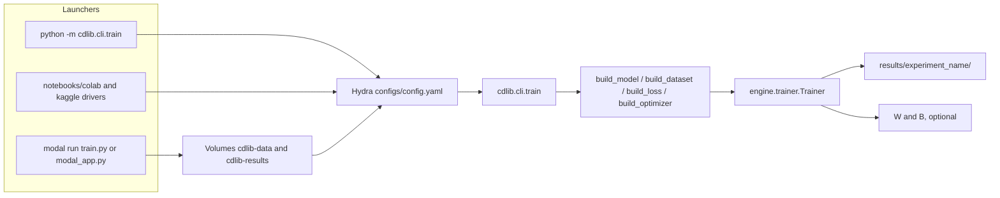

`train.py` at the repo root is only the short Modal command. It re-exports `modal_app` and, under `python train.py`, execs `modal run`. Checkpoints land on the `cdlib-results` volume at `/opt/cdlib/results` when Modal launches the job, and under `./results/<experiment_name>/` locally.

---

## 2. Package map

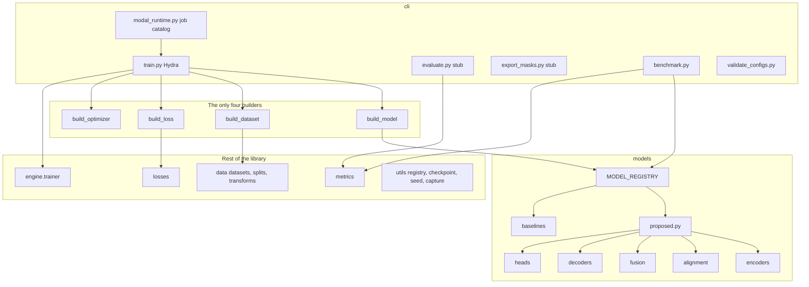

Adding a component is one new file plus one registry line plus one YAML. `build.py` is not edited to add a model, dataset, or loss.

---

## 3. Hydra composition

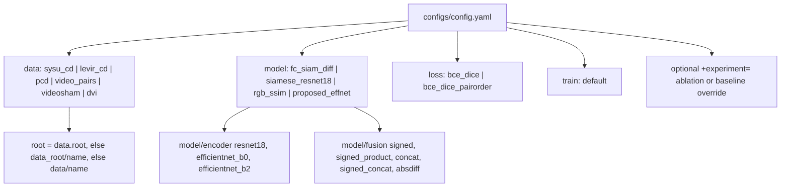

`configs/model/proposed_effnet.yaml` composes encoder `efficientnet_b0` (ImageNet), fusion `signed_fusion` (mode defaults to `signed_product` because the YAML does not set one), alignment `bounded` with `max_offset: 4`, decoder `unet_decoder`, and both heads on.

Named Modal jobs live in `cdlib.cli.modal_runtime.JOBS`. Suites are `baselines`, `proposed`, `ablations`, and `all`.

---

## 4. Training step

`cdlib.cli.train` does not pass `metric_fns`, so the validation pass inside the trainer is loss-only. Corpus F1 and the other metrics run from `cdlib.cli.evaluate` and `cdlib.cli.benchmark`, not from this loop.

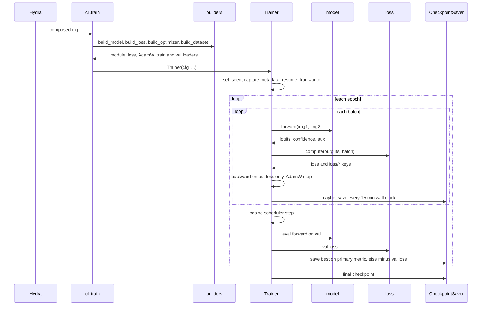

One step is contract-blind. The trainer backprops `out["loss"]` and logs every `loss/*` key. It does not inspect BCE, Dice, or pair-order internals.

AMP is on when the device is CUDA. The default recipe is 200 epochs, batch 8, AdamW `3e-4`, weight decay `0.01`, cosine to `1e-6`.

A checkpoint stores model, optimizer, scheduler, and RNG state. `capture_run_metadata` writes `config.yaml`, `commit.txt`, `command.txt`, and `env.txt` into the run directory. The saver keeps the last 2 checkpoints plus 1 best.

---

## 5. Data pipeline

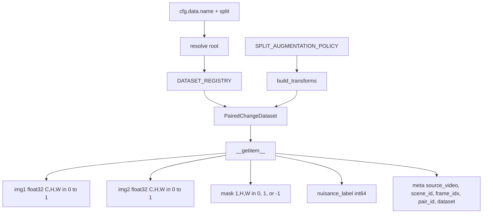

Registered datasets:

| Key | Role |
|---|---|
| `levir_cd` | 256 non-overlapping crops, 7120 / 1024 / 2048 |
| `sysu_cd` | Official 12000 / 4000 / 4000 of 256 pairs. Root default. |
| `pcd` | PCD / TSUNAMI. GSV is off the critical path. |
| `video_pairs` | In-house pairs. Scene split still falls back to a hash partition. |
| `videosham` | Fallback video set. Registered so the switch is a config change. |
| `dvi` | Registered dataset. |

Splits accepted by `build_dataset`: `train`, `val`, `test`, `val_shift`, `cal`. A missing root yields an empty dataset so CI can construct every config with no media on disk. `scene_id` must not cross a split.

Augmentation policy:

| Split | Geometric, shared across the pair | Photometric, independent per frame |
|---|---|---|
| `train` | on | on |
| `val`, `test`, `cal` | off | off |
| `val_shift` | off | on |

`nuisance_label`: `-1` unknown, `0` clean, then `1` camera displacement, `2` lighting, `3` colour grading, `4` blur, `5` shadow, `6` occlusion, `7` codec, `8` sensor noise, `9` mixed. Public CD sets emit unknown. Ignore pixels (`mask == -1`) are dropped from loss and from counts.

ImageNet mean and std constants live on the ResNet encoder module. The dataset contract and `transforms.py` leave pixels in `[0, 1]`. Nothing in the data path applies those constants.

---

## 6. Proposed model

Registered twice, as `proposed` and `proposed_effnet`, both `ProposedModel`. `compute_swap` defaults to true. In train mode the module runs a second forward on `(img2, img1)` and stores `logits_swapped` plus `aux.directional_logits_swapped`. Eval mode does not.

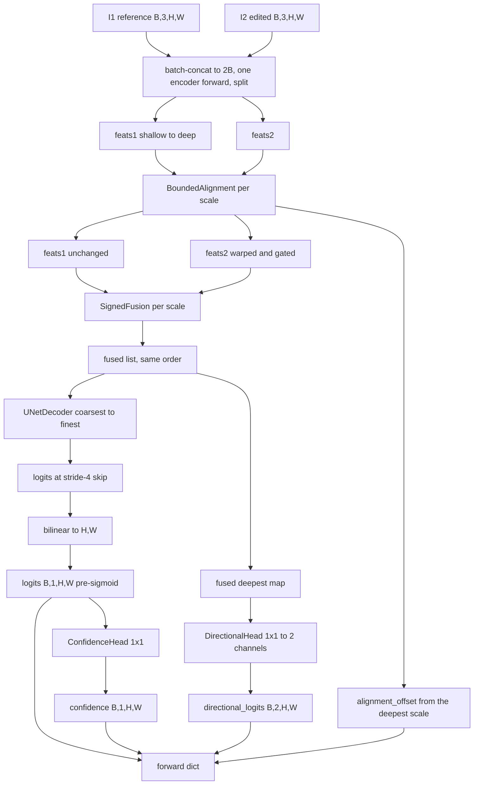

Return value, matching the frozen contract:

```text
{
  logits:              [B, 1, H, W]   pre-sigmoid
  confidence:          [B, 1, H, W] | None
  aux.directional_logits: [B, 2, H, W] | None
  aux.alignment_offset:   [B, 2, h, w]   deepest scale, not resized to the image
  logits_swapped:      train and compute_swap only
  aux.directional_logits_swapped: same
}
```

### Encoder taps

Both encoders implement `forward_pair`: concatenate `[I1; I2]` on the batch axis, one forward, then split. Two sequential forwards are not used.

| Encoder | Key | Taps | Typical channels | Strides |
|---|---|---|---|---|
| ResNet-18 | `resnet18` | C2–C5, `layer1`–`layer4` | 64 / 128 / 256 / 512 | 4 / 8 / 16 / 32 |
| EfficientNet-B0 | `efficientnet_b0` | timm `features_only`, `out_indices (1,2,3,4)` | read at runtime, usually 24 / 40 / 112 / 320 | 4 / 8 / 16 / 32 |
| EfficientNet-B2 | `efficientnet_b2` | same indices | runtime `feature_info` | same four strides |

`use_c5: false` drops the last tap. ResNet `dilate_last: true` keeps four taps and emits the last one at stride 16. `ProposedModel` falls back to ResNet-18 if the encoder spec is missing. The proposed YAML asks for EfficientNet-B0 with ImageNet weights. Nothing in the encoder is frozen.

### Bounded alignment, one scale

Applied to `feats2` only. The last conv of the offset head is zero-initialised, so the module starts as identity. `max_offset` in the YAML is `max_disp` in the module (default 4 pixels).

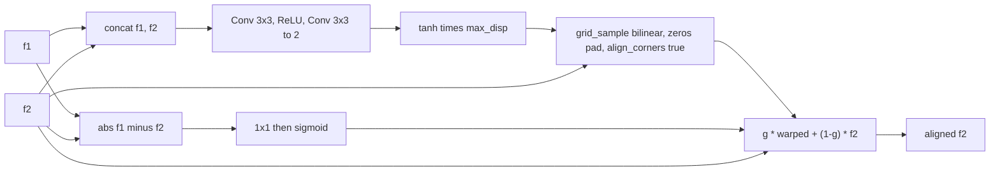

`identity` is the ablation: features pass through and the offset is zeros at the deepest map. The gate is taken from absolute difference, not from the change head.

### Fusion modes

Same op at every scale. Output width is what the decoder is built against.

| Mode | Op | Width |
|---|---|---|
| `signed` | `a - b` | C |
| `signed_product` | `concat(a - b, a * b)` | 2C |
| `concat` | `concat(a, b)` | 2C |
| `signed_concat` | `concat(a - b, a, b)` | 3C |
| `absdiff` | `\|a - b\|` | C |

`absdiff` is order-invariant for any downstream head. Signed difference is not: `h(b - a) = h(-(a - b))` equals `h(a - b)` only when `h` is even. That is why the pair-order term exists. The proposed config uses `signed_product`.

### Decoder

`UNetDecoder` walks coarsest to finest. At each finer scale it bilinear-upsamples, concatenates the skip, and applies Conv–BN–ReLU. A 1×1 head emits one channel at the finest skip (stride 4). `ProposedModel` then bilinear-upsamples logits, confidence, and directional logits to the input size. `align_corners` is false on those interpolations.

---

## 7. Baselines

Every model, including the non-learned floor, returns the same dict. Missing heads are `None`.

```mermaid
flowchart TB
  subgraph ssim [rgb_ssim]
    s1["mean |I1-I2| minus threshold"] --> sL["logits, no parameters that train the mask"]
  end

  subgraph fc [fc_siam_diff]
    fstack["stack to B,2,C,H,W"] --> torchgeo["TorchGeo FCSiamDiff over SMP"]
    torchgeo --> fL["logits"]
  end

  subgraph sia [siamese_resnet18]
    se["ResNet-18 forward_pair"] --> sa["AbsDiffFusion"]
    sa --> su["UNetDecoder"]
    su --> sL2["logits"]
  end

  subgraph pr [proposed / proposed_effnet]
    pe["shared encoder forward_pair"] --> pa["bounded or identity"]
    pa --> pf["signed fusion"]
    pf --> pd["UNetDecoder"]
    pd --> ph["confidence and directional heads"]
    ph --> swap["train-time swapped forward"]
  end
```

`fc_siam_diff` is TorchGeo's FC-Siam-Diff on segmentation-models-pytorch, default encoder ResNet-18 ImageNet. It is not Daudt's original shallow 16/32/64/128 net. `encoder_name` can be swapped. `siamese_resnet18` builds the encoder, abs-diff, and decoder directly and does not go through the alignment or fusion registries.

---

## 8. Losses

`build_loss` injects `pos_weight = (1 - π) / π` when the dataset class publishes `published_changed_pixel_ratio`.

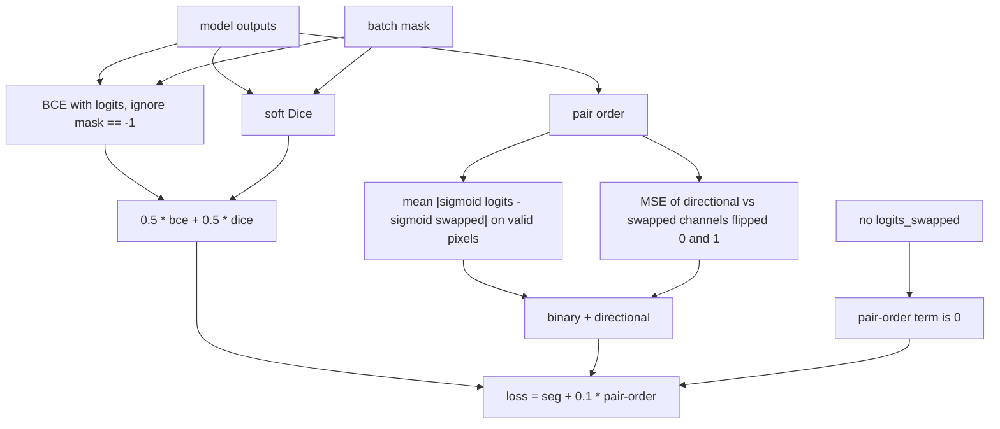

| Registry key | What it is |
|---|---|
| `bce_dice` | Segmentation term only. Root default. |
| `pair_order` | Swap term only. |
| `bce_dice_pairorder` | Sum above. Weight `0.1` on the swap term. Used by the proposed Modal jobs. |
| `calibration` | Registered placeholder. `compute` returns zero. |

Post-hoc calibration is `metrics/temperature.py` (`TemperatureScaler`). It is not fitted inside the trainer.

Under a swap, binary probabilities should match, and the two directional channels should exchange.

---

## 9. Metrics

`METRIC_REGISTRY` keys: `segmentation`, `boundary`, `region`, `calibration`, `robustness`, `swap_consistency`.

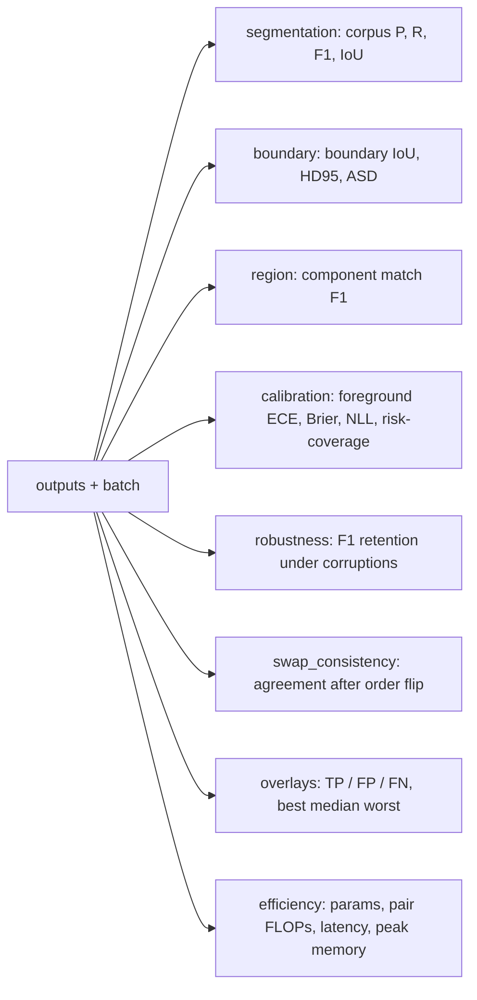

`segmentation` sums TP, FP, and FN over the evaluated set, then computes F1 once. Ignore pixels are excluded. `cdlib.cli.evaluate` and `cdlib.cli.export_masks` still score `DummyPairCNN` on synthetic tensors. `cdlib.cli.benchmark` can construct the real registered models. Corruption functions live in `metrics/corruptions.py` (brightness, gamma, colour grade, blur, motion blur, JPEG, H.264, HEVC, shadow, viewpoint, occlusion).

---

## 10. Modal

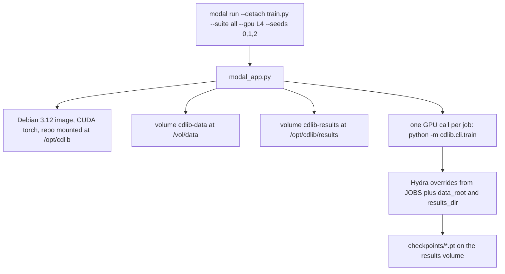

`modal run --detach` keeps the GPU call alive after the laptop disconnects for a single triggered job. A `--suite` fan-out of many `spawn` calls does not have that property if the local entrypoint dies: only the last job stays. Resume is `train.checkpoint.resume_from=auto`.

Download helpers, used to fill the data volume, are `scripts/download_levir_cd.sh`, `scripts/download_sysu_cd.sh`, and `scripts/download_pcd_tsunami.sh`.

---

## Registry catalogue

| Registry | Module | Keys |
|---|---|---|
| `MODEL_REGISTRY` | `models/_model_registry.py` | `rgb_ssim`, `fc_siam_diff`, `siamese_resnet18`, `proposed`, `proposed_effnet` |
| `ENCODER_REGISTRY` | `models/encoders/registry.py` | `resnet18`, `efficientnet_b0`, `efficientnet_b2` |
| `FUSION_REGISTRY` | `models/fusion/registry.py` | `signed_fusion`, `absdiff` |
| `ALIGNMENT_REGISTRY` | `models/alignment/registry.py` | `bounded`, `identity` |
| `DECODER_REGISTRY` | `models/decoders/registry.py` | `unet_decoder` |
| `LOSS_REGISTRY` | `losses/registry.py` | `bce_dice`, `pair_order`, `bce_dice_pairorder`, `calibration` |
| `DATASET_REGISTRY` | `data/registry.py` | `sysu_cd`, `levir_cd`, `pcd`, `video_pairs`, `videosham`, `dvi` |
| `METRIC_REGISTRY` | `metrics/registry.py` | `segmentation`, `boundary`, `region`, `calibration`, `robustness`, `swap_consistency` |

Heads are not registered. `ProposedModel` constructs `ConfidenceHead` and `DirectionalHead` when `heads.confidence` and `heads.directional` are set. Optimizer names are a dict inside `build_optimizer`: `adam`, `adamw`, `sgd`, `rmsprop`.
